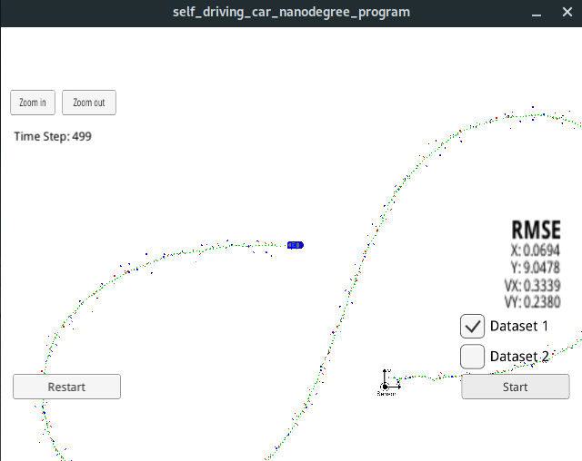
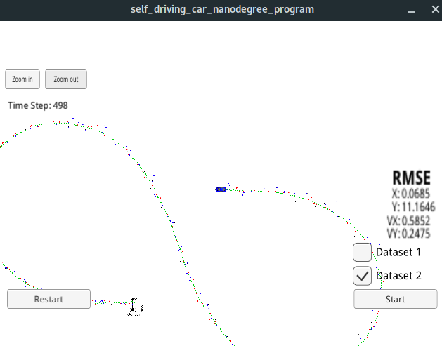
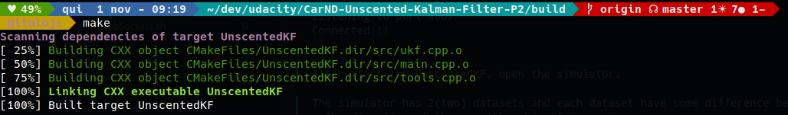

# CarND-Unscented-Kalman-Filter-P2
Udacity Self-Driving Car Nanodegree - Unscented Kalman Filter Implementation

# What is this?

It's a nanodegree self-driving car project and it consists of implementing an [Unscented Kalman Filter](https://en.wikipedia.org/wiki/Kalman_filter#Unscented_Kalman_filter) implemented with C++. 

A udacity's simulator ([it could be downloaded here](https://github.com/udacity/self-driving-car-sim/releases)) generates data with noisy RADAR and LIDAR measurements of a object's position and object's velocity, and the Unscented Kalman Filter[UKF] must fusion those measurements to predict the object's position. The communication between the simulator and the UKF is done using [WebSocket](https://en.wikipedia.org/wiki/WebSocket) using the [uWebSockets](https://github.com/uNetworking/uWebSockets) implementation on the UKF side.

# Prerequisites

The project has the following dependencies (from Udacity's seed project):

- cmake >= 3.5
- make >= 4.1
- gcc/g++ >= 5.4
- Udacity's simulator.

In order to install the necessary libraries, use the [install-uWebSockets.sh](./install-uWebSockets.sh).

# Compiling the project

These are the suggested steps:

- `mkdir build`
- `cd build`
- `cmake ..`
- `make`

## Running the Filter

From the `build` directory, execute `./UnscentedKF`.The output should be:

```
Listening to port 4567
Connected!!!
```

After start the UnscentedKF, open the simulator.

The simulator has 2(two) datasets and each dataset have some difference between them:
- The direction of the car (the object) is moving.
- On dataset 1, the LIDAR measurement is sent first. 
- On the dataset 2, the RADAR measurement is sent first.

### Simulator running with dataset 1:



### Simulator running with dataset 2:



# [Rubric](https://review.udacity.com/#!/rubrics/783/view) points

## Compiling

### Your code should compile.


## Accuracy

### px, py, vx, vy output coordinates must have an RMSE <= [.09, .10, .40, .30] when using the file: "obj_pose-laser-radar-synthetic-input.txt", which is the same data file the simulator uses for Dataset 1.

The UKF accuracy was:

- Dataset 1 : RMSE = [0.0693, 0.0835, 0.3336, 0.2380]
- Dataset 2 : RMSE = [0.0685, 0.0693, 0.5846, 0.2473]

## Following the Correct Algorithm

### Your Sensor Fusion algorithm follows the general processing flow as taught in the preceding lessons.

The implementation of UKF could be found at [src/ukf.cpp](./src/ukf.cpp). The [Prediction()](./src/ukf.cpp#L101) is executed on for the prediction step, and we update step depending on the measurement type executing the methods [UpdateRadar()](./src/ukf.cpp#L105) and [UpdateLidar()](./src/ukf.cpp#L109).

### Your Kalman Filter algorithm handles the first measurements appropriately.

The first measurement (RADAR or LIDAR) is handled in [ProcessMeasurement](src/ukf.cpp#L74)
### Your Kalman Filter algorithm first predicts then updates.

The prediction step is implemented inside the [Prediction()](./src/ukf.cpp#L113) method

### Your Kalman Filter can handle radar and lidar measurements.

yes, they are handleade at [UKF class](src/ukf.cpp):

- First measurement from line 74
- Update step from line 103
